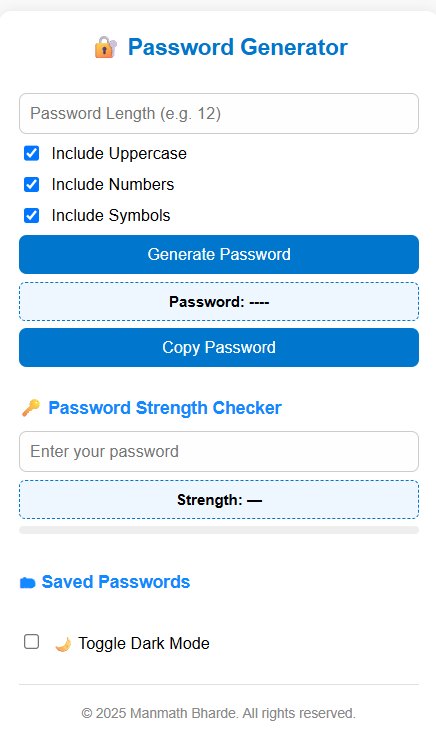
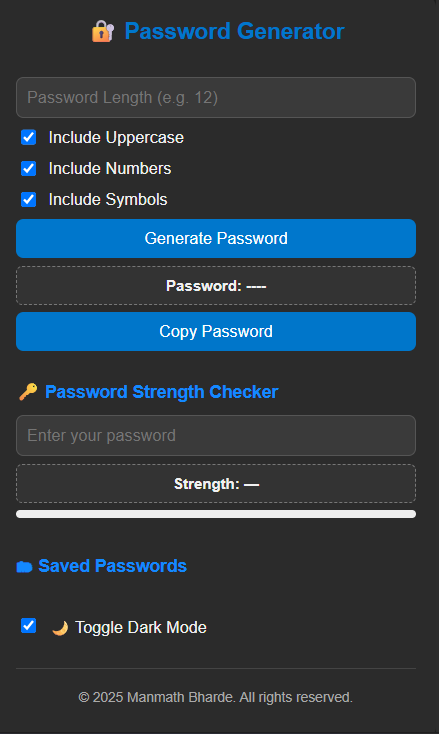

# 🔐 Smart Password Generator & Strength Checker
A secure and user-friendly Chrome extension to generate strong passwords and evaluate their strength in real time. Designed to promote better password habits with instant feedback, optional history saving, and a clean, responsive interface.
 
---
## 🚀 Features
- 🔢 Generate secure passwords of custom length
- 🔠 Include uppercase letters, numbers, and special characters
- 📊 Real-time password strength checker with progress bar and suggestions
- 💾 Auto-save the last 10 generated passwords locally
- 🌙 Dark Mode toggle with preference memory
- 📋 One-click copy to clipboard
---
## 📸 Screenshots
> *(Replace these with your own screenshots if needed)*
Light Mode | Dark Mode
:--:|:--:
 | 
---

## 🛠 Installation (Chrome)
1. Clone or download this repo.
2. Open `chrome://extensions/` in your Chrome browser.
3. Enable **Developer mode** (top right).
4. Click **Load unpacked**.
5. Select the project folder.
Your extension icon should now appear in the toolbar!
---

## 🗂 Project Structure
smart-password-generator-extension/
├── icons/ # Extension icons
├── popup.html # Main popup UI
├── popup.css # Styling
├── popup.js # Logic and interactions
├── manifest.json # Chrome extension config
└── README.md # This file
---

## 🔧 Built With
- HTML5, CSS3, JavaScript (Vanilla)
- Chrome Extension API (Manifest v3)
- LocalStorage for data persistence
---

## 🧑‍💻 Author
**Manmath Bharde**  
📧 manmath.bharde01@gmail.com  
🌐 [LinkedIn](https://www.linkedin.com/in/your-profile) <!-- Update if needed -->
---

## 📄 License
This project is licensed under the [MIT License](LICENSE).
---

## 🌟 Contribute / Star
If you find this helpful, feel free to ⭐ the repo or contribute!

